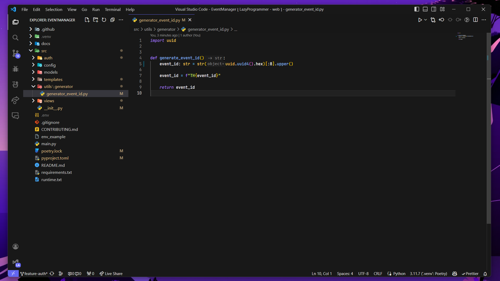
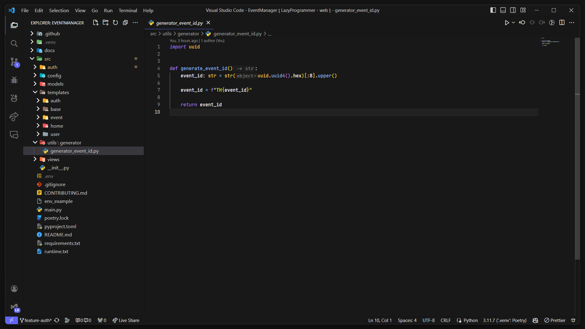

# WinterIsCoding - VS Code Theme

**WinterIsCoding** is a sleek and modern theme pack designed for developers who want a smooth, clean coding experience. It comes in four distinct dark mode variations to suit your coding flow and style preferences.

## Themes Included:

1. **WinterIsCoding** - The standard dark theme with cool, calming tones for a distraction-free coding experience.
2. **WinterIsCoding Flow** - A smooth, flowing dark theme designed for seamless transitions between different coding tasks.
3. **WinterIsCoding Zone** - A focused dark theme with enhanced contrast, perfect for deep work.
4. **WinterIsCoding Zone [no italic]** - A variation of the Zone theme for those who prefer clean, non-italicized text.

## Features:

-   Optimized for readability and focus with carefully selected colors.
-   Dark themes that reduce eye strain during long coding sessions.
-   Fully compatible with a wide range of programming languages and file types.
-   Support for italic and non-italic text to match your style preferences.

## Installation

### Visual Studio Code Marketplace:

1. Open VS Code.
2. Go to the Extensions view by clicking the Extensions icon in the Activity Bar.
3. Search for `WinterIsCoding`.
4. Click **Install**.
5. Open the Command Palette (`Ctrl+Shift+P` or `Cmd+Shift+P` on macOS), then type and select `Preferences: Color Theme`.
6. Choose your preferred WinterIsCoding theme from the list.

### Manual Installation:

1. Clone or download this repository.
2. Copy the theme files to your VS Code `extensions` folder.
3. Open the Command Palette (`Ctrl+Shift+P`), then select `Preferences: Color Theme` and pick your desired theme.

## Themes Preview

### WinterIsCoding

### WinterIsCoding Flow

### WinterIsCoding Zone

### WinterIsCoding Zone : no italic

## Contributing

We welcome contributions! If you have ideas or improvements, feel free to fork the repository, create a new branch, and submit a pull request. Let's make WinterIsCoding even better together.

## License

This theme is licensed under the [MIT License](./LICENSE.md).

---

Enjoy coding with **WinterIsCoding**! ❄️
