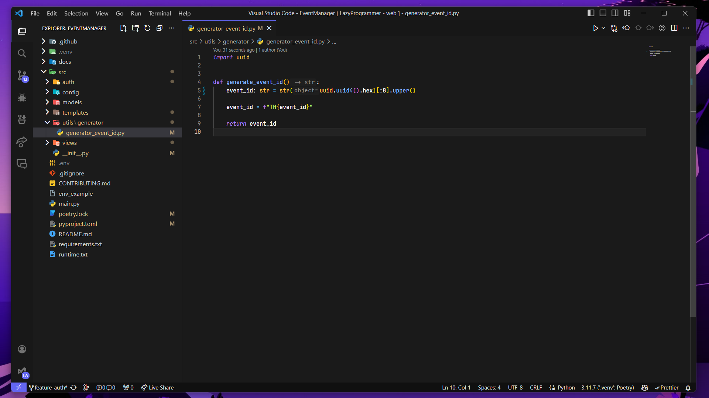
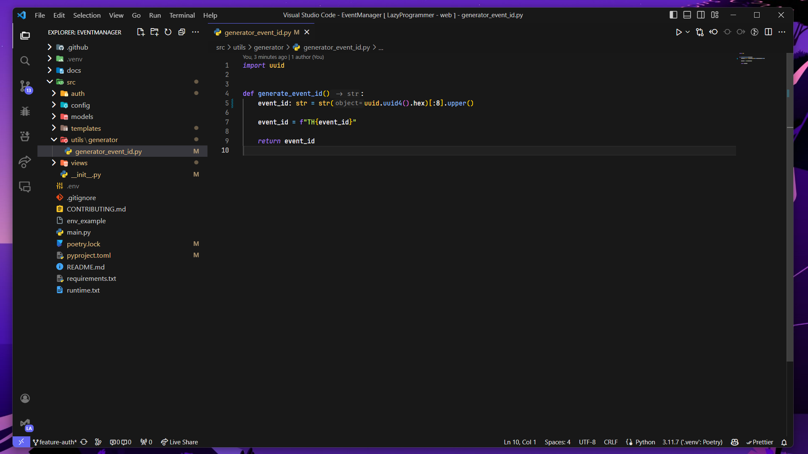
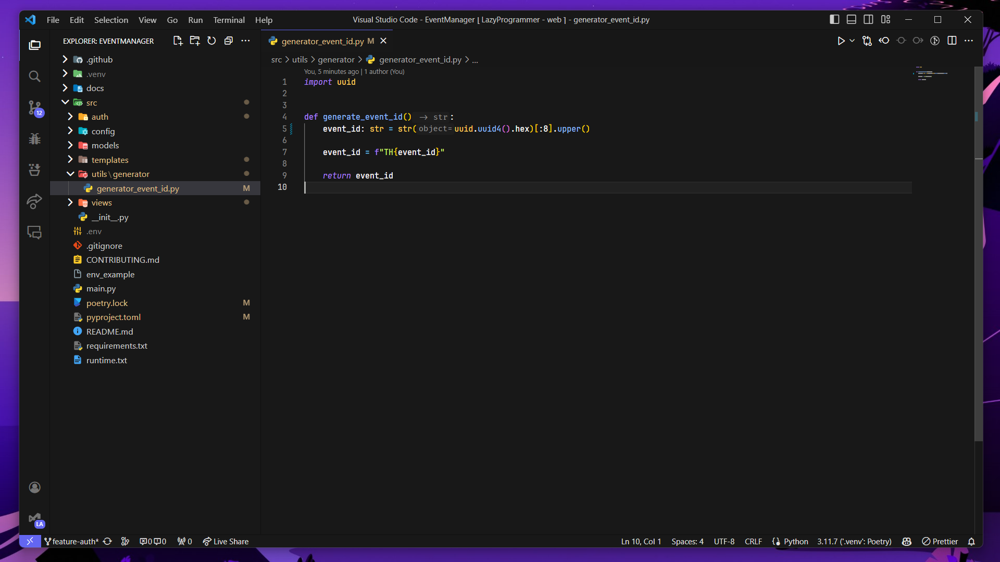

# ❄️ WinterIsCoding — Modern VS Code Theme Pack

**WinterIsCoding** is a sleek, modern, cold-toned theme pack designed for developers who thrive in clean, distraction-free coding environments.

---

## 🎨 Themes Included

### 🏛️ The OG Lineup (Same Canonical Syntax, Different Architectural Framing)

| Variant | Concept & Framing | Ideal Usage |
| :--- | :--- | :--- |
| **`WinterIsCoding [OG]`** | **Complete Panels Design**: Multi-layer panel depth with cool midnight surface tones | Everyday coding & general IDE usage |
| **`WinterIsCoding [OG] Flow`** | **Single Sheet Canvas**: Borderless fluid surface with no dividing panel lines (`#00000000`) | Smooth multi-hour coding sessions |
| **`WinterIsCoding [OG] Zone`** | **Framed Focus Zones**: Crisp, structured boundary borders (`#282828`) around every pane | Deep focus & high-concentration work |
| **`WinterIsCoding [OG] Zone [no italic]`** | **Clean Non-Italic Zone**: Framed zone layout with strictly non-italicized syntax | Codebases requiring uniform typography |

### 🚀 The New Lineup (Dedicated Color & Semantic Architectures)

| Variant | Concept & Focus | Ideal Usage |
| :--- | :--- | :--- |
| **`WinterIsCoding [New] Midnight OLED`** | **Pure Black OLED (#000000)**: Ultra-deep contrast optimized for OLED displays | Battery saving & maximum contrast |
| **`WinterIsCoding [New] Frost Light`** | **Crisp Blizzard Light**: 100% pure slate & ice blue light theme | Bright environments & daytime coding |
| **`WinterIsCoding [New] Focus Mode`** | **Deep Obsidian Monolith (#0D1117)**: Seamless GitHub/Obsidian surface system | Terminal-first & distraction-free flow |
| **`WinterIsCoding [New] Ergonomic Preview`** | **Cognitive Ergonomics**: Mint strings (`#5EEAD4`), boosted AA keywords (`#818CF8`) | Extended deep-work & ocular comfort |

---

## 🖌️ Palette Breakdown

| Syntax Token | Color Hex | Visual Swatch |
| :--- | :--- | :--- |
| **Keywords & Controls** | `#6366F1` | 🟪 Electric Indigo |
| **Functions & Methods** | `#FFCC5C` | 🟨 Frost Gold |
| **Types & Classes** | `#8DBDFF` | 🟦 Sky Cyan |
| **Strings & Text** | `#77D2FF` | 🟦 Ice Blue |
| **Macros & Annotations** | `#AE81FF` | 🟪 Lavender Purple |
| **Comments (WCAG AA)** | `#808080` | ⬜ Slate Gray |

---

## 📸 Previews

### WinterIsCoding

### WinterIsCoding Flow

### WinterIsCoding Zone

---

## 🖥️ Terminal Extras

Companion color schemes for modern terminal emulators are included in the [`extras/`](./extras) folder:

- **Warp Terminal**:
  - `WinterIsCoding [OG]`: [`extras/warp/winteriscoding-og.yaml`](./extras/warp/winteriscoding-og.yaml)
  - `WinterIsCoding [OG] Zone`: [`extras/warp/winteriscoding-og-zone.yaml`](./extras/warp/winteriscoding-og-zone.yaml)
- **Windows Terminal**: [`extras/windows-terminal/winteriscoding.json`](./extras/windows-terminal/winteriscoding.json)
- **Alacritty**: [`extras/alacritty/winteriscoding.toml`](./extras/alacritty/winteriscoding.toml)

---

## 📦 Installation

### Visual Studio Code Marketplace

1. Open **VS Code**.
2. Press `Ctrl+P` (or `Cmd+P` on macOS) and run `ext install winterx64.winteriscoding`.
3. Open the Command Palette (`Ctrl+Shift+P` / `Cmd+Shift+P`), search `Preferences: Color Theme`, and pick your preferred variant.

---

## 📄 License

Licensed under the [MIT License](./LICENSE.md).

Enjoy coding with **WinterIsCoding**! ❄️
